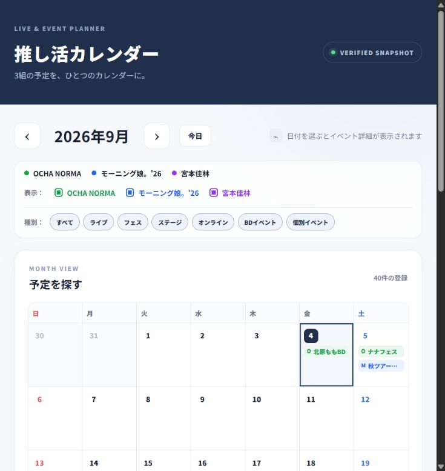

# Codexで推し活カレンダーを作ってみた

ライブやイベントの予定を、アーティストごとに別々の公式ページで確認するのが少し大変だったので、OCHA NORMA、モーニング娘。'26、宮本佳林の予定をまとめて見られるカレンダーを作りました。

今回は「正確な自動取得」までを完成させるのではなく、まずは公開情報を整理して、予定を探しやすい画面にすることを目標にしました。

## 課題

イベント名、開催地、イベントの種類、チケット受付状況が別々に掲載されていると、月単位で予定を把握するにはページを行き来する必要があります。また、カレンダー内に正式名称だけを表示すると、リミスタやBDイベントのような主題が分かりにくくなることもありました。

## 作ってみる

作成したのは、3組の予定を月間カレンダーで表示する非公式ファン向けWebアプリです。

- アーティストごとの表示切り替え
- ライブ、フェス、BDイベント、リリース、舞台などの種別フィルター
- 「リミスタ（サイン会）」「秋ツアー福岡」のようなカレンダー向け短縮名
- 日付を選択したときの会場、チケット状況、受付期間、公式リンクの表示
- 期間イベントを複数の日付に表示

## 完成画面

3組のアーティストを色で区別し、ライブやBDイベントなどの種別で絞り込めるようにしています。カレンダー上の表示名は、正式名称だけでは主題が分かりにくいものを短く整理しました。

## どう作ったか

画面はReact、TypeScript、Viteで作成しました。イベント情報は、まずTypeScriptの構造化データとして整理しています。各イベントには、開催日、イベント種別、会場、チケット状況、公式URLなどを持たせ、画面側では同じデータをカレンダー表示と詳細表示の両方に利用します。

チケット情報は、確認できた公式ページの内容を短く要約しています。たとえば北原ももBDイベントは、当日券予約販売の受付期間を確認したうえで「当日券受付中」と表示しています。公式ページの文章をそのまま転載せず、必要な情報だけを要約しました。ただし、受付状況は変わるため、アプリ内にも公式ページを確認する案内を残しています。

## AIを使った部分

Codexには、画面の実装、イベント情報の構造化、フィルター、カレンダー内の短縮表示、ビルド確認を依頼しました。

一方で、どの情報を公開対象にするか、会員限定情報を掲載しないこと、公式リンクを残すこと、イベント名をどの程度短くするかは人が判断しました。AIが解析した内容をそのまま正しいとみなさず、公式ページと照合することを前提にしています。

## 実務で使えるか

現時点では、公開情報を整理したスナップショットとして、予定の全体像を確認する用途に使えます。イベント種別で絞り込めるため、ライブだけ、舞台だけという見方もできます。

一方で、ページの自動巡回、受付状況の自動更新、ログインが必要な情報の取得は実装していません。チケット販売状況を確実に保証するサービスではないため、申込み前には必ず公式ページを確認してください。

## 改善点

- 公式の公開ページを対象にした更新処理
- 新規イベントの発見と既存イベントの変更検知
- 変更の根拠URLと確認日時の管理
- 判断できない情報を公開せず、確認待ちとして扱う仕組み
- GitHubとCloudflare Pagesを使った公開

自動更新を行う場合も、会員限定情報を取得しないこと、長文転載をしないこと、根拠URLがない変更を公開しないことを条件にします。

## GitHub

GitHubリポジトリURLは公開後に追記します。

起動方法はリポジトリのREADMEにまとめています。リポジトリに含まれるイベント情報は、確認日時点の公開ページをもとに整理したスナップショットであり、公式データベースではないことを明記します。

## まとめ

まずは自動取得よりも、予定を探しやすく、イベントの主題と公式リンクが分かる画面を作ることを優先しました。AIは実装と整理を速くできますが、公開する情報の範囲と、掲載内容を公式ページで確認する責任は人に残ります。
