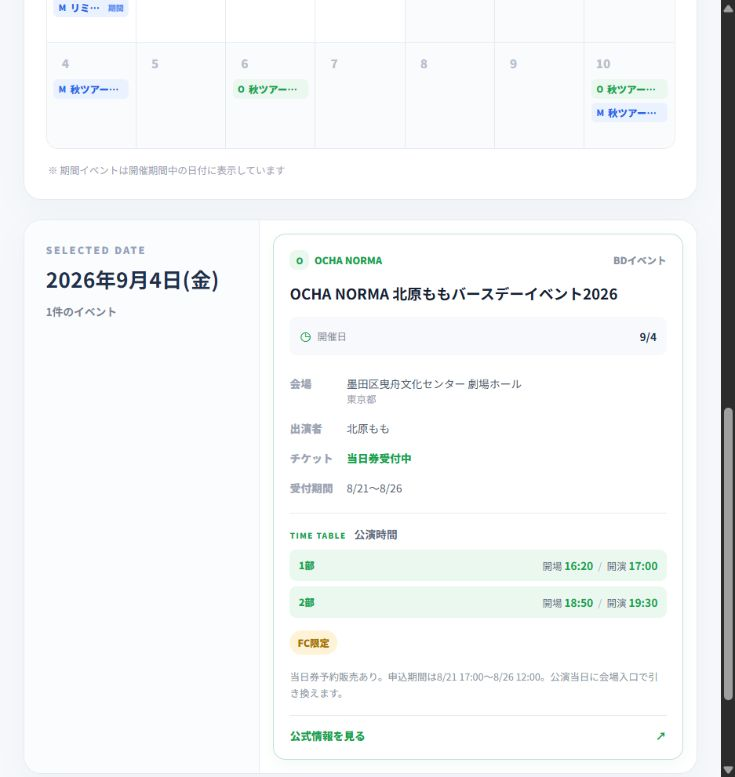

# 推し活の予定をひとつに。3組のライブ・イベントカレンダーをCodexで作った

推しのライブやイベントを追いかけていると、「予定を確認するだけ」のはずが、意外といくつものページを行き来することになります。

そこで今回、自分が追っているOCHA NORMA、モーニング娘。'26、宮本佳林の予定を、ひとつの月間カレンダーで確認できるWebアプリを作りました。

このアプリは、公式サイトに代わるものではありません。

「この月はどのライブに行けそうか」

「ライブ以外にはどんなイベントがあるか」

「チケットの受付状況を確認しておきたい予定はどれか」

こうした推し活の作戦会議を始める前に、まず予定の全体像を見渡せるようにすることが目的です。

※本アプリは非公式のファン作成アプリです。

## きっかけは、予定を比較しにくかったこと

アーティストごとのスケジュール、ツアーの詳細、リリースイベント、チケットのお知らせなどは、必ずしもひとつのページにまとまっているわけではありません。

公式サイトや告知ページを行き来しながら、開催日や会場、イベントの種類を確認していると、「同じ月の予定を並べて、どれに行くか考える」という最初の段階にも時間がかかります。

そこで、まずは3組の予定をひとつの画面に集め、日付・場所・イベント種別を比較しやすくしました。

これまで頭の中でしていた「どのライブに行くか作戦会議」を、カレンダー上で始められるようにするイメージです。

## 作ったアプリでできること

アプリには、2026年8月22日時点で確認した公開情報をもとに、40件のイベントデータを登録しています。

- 3組のアーティストを色分けして表示
- アーティストごとに表示・非表示を切り替え
- ライブ、フェス、ステージ、オンライン、BDイベント、個別イベントで絞り込み
- 「北原ももBD」「秋ツアー福岡」「リミスタ（サイン会）」など、主題が分かる短いイベント名を表示
- 日付を選ぶと、会場、出演者、公演時間、チケット状況、受付期間、公式リンクを確認
- 複数日にわたるイベントは、開催期間中の各日付に表示

カレンダーを開いたときに正式名称の長い文字列を読むのではなく、まずは「何の予定なのか」を短く把握できるようにしています。

## カレンダー画面

画面上部には、アーティストとイベント種別のフィルターを配置しました。

「ライブだけを表示する」「OCHA NORMAの予定だけを残す」といった絞り込みができます。

3組の表示色は、以下のように分けています。

- OCHA NORMA：緑
- モーニング娘。'26：青
- 宮本佳林：紫

## 詳細画面

カレンダーの日付を選ぶと、その日に登録されているイベントの詳細が表示されます。

北原ももBDイベントの例では、次の情報を確認できます。

- 会場
- 出演者
- 開場・開演時間
- チケットの受付状況
- 受付期間
- 公式情報へのリンク

カレンダーで予定を見つけ、気になったイベントだけ詳しく確認できる構成にしました。

## チケット情報の扱い

チケット情報は、確認できた公式ページの内容を、アプリで使いやすいように短く整理しています。

例えば北原ももBDイベントでは、2026年8月22日時点で公式ページに掲載されていた当日券予約販売の案内を確認し、アプリ上では「当日券受付中」「受付期間 8/21〜8/26」と表示しました。

公式ページの文章をそのまま長く転載したり、画像を取り込んだりするのではなく、開催日・受付状況・受付期間・公式リンクなど、予定を検討するために必要な項目に絞っています。

ただし、チケットの受付状況や条件は変更される可能性があります。実際に申し込む際は、必ずリンク先の公式ページで最新情報を確認する前提です。

## 最初から自動取得にしなかった理由

将来的には、新しいイベントの追加や受付状況の変更を自動で確認できるようにしたいと考えています。

ただ、最初から自動巡回まで実装しようとすると、次のような問題も扱う必要があります。

- ページごとの表記ゆれ
- 同じイベントに対する複数の告知ページ
- 受付中から受付終了への変更判断
- 会員向けページと一般公開ページの区別
- 取得した情報をそのまま公開してよいかの判断

そこで今回は、自動化より先に「どんな情報を、どのくらいの粒度で見せると使いやすいか」を確かめることにしました。

現在のアプリは、2026年8月22日時点の公開情報をまとめたスナップショットです。ページの自動巡回や日次の自動更新は行っていません。

## Codexに任せたこと、人が判断したこと

実装にはCodexを使いました。

Codexには、主に次の作業を依頼しています。

- React・TypeScript・Viteによる画面実装
- 月間カレンダーの表示
- アーティストとイベント種別のフィルター
- イベントデータの構造化
- カレンダー内で使用するイベント名の短縮表示
- ビルド確認

一方で、次の内容は人が判断しています。

- どのアーティストを対象にするか
- カレンダー上のイベント名をどこまで短くするか
- どの情報を詳細画面に表示するか
- 必ず公式ページへのリンクを残すこと
- 一般公開されている情報だけを扱うこと
- ログインが必要な情報や長文、画像を掲載しないこと

AIがページの内容を整理できても、その情報が正しいか、どこまで公開してよいかを確認する責任まで自動化できるわけではありません。

今回は、公式ページとの照合と、情報を確認した日付を残すことを重視しました。

## 公開しているデータについて

掲載しているのは、確認日時点で公式サイトから一般に閲覧できた予定と、そこから整理した短い事実情報です。

FC向けイベントであっても、開催告知が一般公開されている場合は、開催日・会場・受付状況などを必要最小限に整理し、元の公式ページへのリンクを残しています。

一方で、次のような情報はリポジトリに含めていません。

- ログインが必要なページの内容
- 会員番号などの個人情報
- 公式サイトの画像
- 公式ページの長文本文

公開情報であっても自由に転載できるとは限らないため、各公式サイトの規約や権利条件に従い、公開してよいか判断できない情報は掲載しない方針です。

## 今後追加したいこと

現在は、予定の全体像を確認し、アーティストやイベント種別で絞り込むところまで実装しています。

今後は、次のような仕組みを検討しています。

- 公式の公開ページを対象にした新規イベントの発見
- 既存イベントの日時・会場・受付状況の変更検知
- 変更の根拠となるURLと確認日時の保存
- 自動で判断できない情報を公開せず、確認待ちにする仕組み

自動更新を追加する場合も、会員限定情報を取得しないこと、公式ページの長文を転載しないこと、根拠となるURLがない変更をそのまま公開しないことを条件にしたいと考えています。

## GitHubで公開しています

ソースコードとREADMEは、GitHubで公開しています。

[GitHubリポジトリ：BAD-TERUMARU/oshi-calendar](https://github.com/BAD-TERUMARU/oshi-calendar)

READMEには、アプリの起動方法、使用している技術、データのスナップショット日、非公式アプリであること、公開情報を扱う際の注意点をまとめています。

技術構成は、React・TypeScript・Viteです。通常はイベントデータを含む静的なフロントエンドとして動作します。

## まとめ

今回は、推しの予定を探すために複数の公式ページを行き来する負担を減らし、「次はどのライブに行く？」を考えやすくするカレンダーを作りました。

最初からすべてを自動化するのではなく、まずは見たい情報の形を決め、公式リンクと確認日を残したスナップショットとして公開しています。

Codexを使うことで、画面の実装やイベントデータの整理は速く進められました。一方で、何を掲載し、どこまで公開するかは人が判断する必要があります。

今後は、この「人が確認できる状態」を残しながら、新しいイベントの発見や情報変更の検知を少しずつ自動化していきたいと思います。
